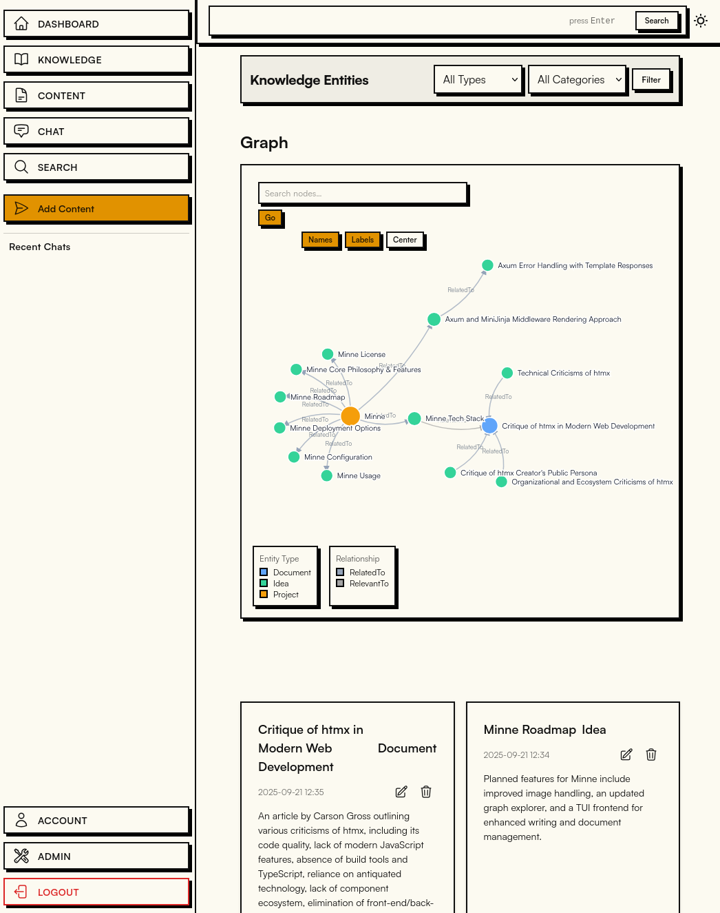

# Minne - A Graph-Powered Personal Knowledge Base

**Minne (Swedish for "memory")** is a personal knowledge management system and save-for-later application for capturing, organizing, and accessing your information. Inspired by the Zettelkasten method, it uses a graph database to automatically create connections between your notes without manual linking overhead.

[](https://github.com/perstarkse/minne/actions/workflows/release.yml)
[](https://www.gnu.org/licenses/agpl-3.0)
[](https://github.com/perstarkse/minne/releases/latest)



## Demo deployment

To test _Minne_ out, enter [this](https://minne-demo.stark.pub) read-only demo deployment to view and test functionality out.

## Noteworthy Features

- **Search & Chat Interface** - Find content or knowledge instantly with full-text search, or use the chat mode and conversational AI to find and reason about content
- **Manual and AI-assisted connections** - Build entities and relationships manually with full control, let AI create entities and relationships automatically, or blend both approaches with AI suggestions for manual approval 
- **Hybrid Retrieval System** - Search combining vector similarity, full-text search, and graph traversal for highly relevant results
- **Scratchpad Feature** - Quickly capture thoughts and convert them to permanent content when ready
- **Visual Graph Explorer** - Interactive D3-based navigation of your knowledge entities and connections
- **Multi-Format Support** - Ingest text, URLs, PDFs, audio files, and images into your knowledge base
- **Performance Focus** - Built with Rust and server-side rendering for speed and efficiency
- **Self-Hosted & Privacy-Focused** - Full control over your data, and compatible with any OpenAI-compatible API that supports structured outputs

## The "Why" Behind Minne

For a while I've been fascinated by personal knowledge management systems. I wanted something that made it incredibly easy to capture content - snippets of text, URLs, and other media - while automatically discovering connections between ideas. But I also wanted to maintain control over my knowledge structure.

Traditional tools like Logseq and Obsidian are excellent, but the manual linking process often became a hindrance. Meanwhile, fully automated systems sometimes miss important context or create relationships I wouldn't have chosen myself.

So I built Minne to offer the best of both worlds: effortless content capture with AI-assisted relationship discovery, but with the flexibility to manually curate, edit, or override any connections. You can let AI handle the heavy lifting of extracting entities and finding relationships, take full control yourself, or use a hybrid approach where AI suggests connections that you can approve or modify.

While developing Minne, I discovered [KaraKeep](https://github.com/karakeep-app/karakeep) (formerly Hoarder), which is an excellent application in a similar space – you probably want to check it out! However, if you're interested in a PKM that offers both intelligent automation and manual curation, with the ability to chat with your knowledge base, then Minne might be worth testing.

## Table of Contents

- [Quick Start](#quick-start)
- [Features in Detail](#features-in-detail)
- [Configuration](#configuration)
- [Tech Stack](#tech-stack)
- [Application Architecture](#application-architecture)
- [AI Configuration](#ai-configuration--model-selection)
- [Roadmap](#roadmap)
- [Development](#development)
- [Contributing](#contributing)
- [License](#license)

## Quick Start

The fastest way to get Minne running is with Docker Compose:

```bash
# Clone the repository
git clone https://github.com/perstarkse/minne.git
cd minne

# Start Minne and its database
docker compose up -d

# Access at http://localhost:3000
```

**Required Setup:**
- Replace `your_openai_api_key_here` in `docker-compose.yml` with your actual API key
- Configure `OPENAI_BASE_URL` if using a custom AI provider (like Ollama)

For detailed installation options, see [Configuration](#configuration).

## Features in Detail

### Search vs. Chat mode

**Search** - Use when you know roughly what you're looking for. Full-text search finds items quickly by matching your query terms.

**Chat Mode** - Use when you want to explore concepts, find connections, or reason about your knowledge. The AI analyzes your query and finds relevant context across your entire knowledge base.

### Content Processing

Minne automatically processes content you save:
1. **Web scraping** extracts readable text from URLs
2. **Text analysis** identifies key concepts and relationships
3. **Graph creation** builds connections between related content
4. **Embedding generation** enables semantic search capabilities

### Visual Knowledge Graph

Explore your knowledge as an interactive network with flexible curation options:

**Manual Curation** - Create knowledge entities and relationships yourself with full control over your graph structure

**AI Automation** - Let AI automatically extract entities and discover relationships from your content

**Hybrid Approach** - Get AI-suggested relationships and entities that you can manually review, edit, or approve

The graph visualization shows:
- Knowledge entities as nodes (manually created or AI-extracted)
- Relationships as connections (manually defined, AI-discovered, or suggested)
- Interactive navigation for discovery and editing

## Tech Stack

- **Backend:** Rust with Axum framework and Server-Side Rendering (SSR)
- **Frontend:** HTML with HTMX and minimal JavaScript for interactivity
- **Database:** SurrealDB (graph, document, and vector search)
- **AI Integration:** OpenAI-compatible API with structured outputs
- **Web Processing:** Headless Chrome for robust webpage content extraction

## Configuration

Minne can be configured using environment variables or a `config.yaml` file. Environment variables take precedence over `config.yaml`.

### Required Configuration

- `SURREALDB_ADDRESS`: WebSocket address of your SurrealDB instance (e.g., `ws://127.0.0.1:8000`)
- `SURREALDB_USERNAME`: Username for SurrealDB (e.g., `root_user`)
- `SURREALDB_PASSWORD`: Password for SurrealDB (e.g., `root_password`)
- `SURREALDB_DATABASE`: Database name in SurrealDB (e.g., `minne_db`)
- `SURREALDB_NAMESPACE`: Namespace in SurrealDB (e.g., `minne_ns`)
- `OPENAI_API_KEY`: Your API key for OpenAI compatible endpoint
- `HTTP_PORT`: Port for the Minne server (Default: `3000`)

### Optional Configuration

- `RUST_LOG`: Controls logging level (e.g., `minne=info,tower_http=debug`)
- `DATA_DIR`: Directory to store local data (e.g., `./data`)
- `OPENAI_BASE_URL`: Base URL for custom AI providers (like Ollama)

### Example config.yaml

```yaml
surrealdb_address: "ws://127.0.0.1:8000"
surrealdb_username: "root_user"
surrealdb_password: "root_password"
surrealdb_database: "minne_db"
surrealdb_namespace: "minne_ns"
openai_api_key: "sk-YourActualOpenAIKeyGoesHere"
data_dir: "./minne_app_data"
http_port: 3000
# rust_log: "info"
```

## Installation Options

### 1. Docker Compose (Recommended)

```bash
# Clone and run
git clone https://github.com/perstarkse/minne.git
cd minne
docker compose up -d
```

The included `docker-compose.yml` handles SurrealDB and Chromium dependencies automatically.

### 2. Nix

```bash
nix run 'github:perstarkse/minne#main'
```

This fetches Minne and all dependencies, including Chromium.

### 3. Pre-built Binaries

Download binaries for Windows, macOS, and Linux from the [GitHub Releases](https://github.com/perstarkse/minne/releases/latest).

**Requirements:** You'll need to provide SurrealDB and Chromium separately.

### 4. Build from Source

```bash
git clone https://github.com/perstarkse/minne.git
cd minne
cargo run --release --bin main
```

**Requirements:** SurrealDB and Chromium must be installed and accessible in your PATH.

## Application Architecture

Minne offers flexible deployment options:

- **`main`**: Combined server and worker in one process (recommended for most users)
- **`server`**: Web interface and API only
- **`worker`**: Background processing only (for resource optimization)

## Usage

Once Minne is running at `http://localhost:3000`:

1. **Web Interface**: Full-featured experience for desktop and mobile
2. **iOS Shortcut**: Use the [Minne iOS Shortcut](https://www.icloud.com/shortcuts/e433fbd7602f4e2eaa70dca162323477) for quick content capture
3. **Content Types**: Save notes, URLs, audio files, and more
4. **Knowledge Graph**: Explore automatic connections between your content
5. **Chat Interface**: Query your knowledge base conversationally

## AI Configuration & Model Selection

### Setting Up AI Providers

Minne uses OpenAI-compatible APIs. Configure via environment variables or `config.yaml`:

- `OPENAI_API_KEY` (required): Your API key
- `OPENAI_BASE_URL` (optional): Custom provider URL (e.g., Ollama: `http://localhost:11434/v1`)

### Model Selection

1. Access the `/admin` page in your Minne instance
2. Select models for content processing and chat from your configured provider
3. **Content Processing Requirements**: The model must support structured outputs
4. **Embedding Dimensions**: Update this setting when changing embedding models (e.g., 1536 for `text-embedding-3-small`, 768 for `nomic-embed-text`)

## Roadmap

Current development focus:

- TUI frontend with system editor integration
- Enhanced reranking for improved retrieval recall
- Additional content type support

Feature requests and contributions are welcome!

## Development

```bash
# Run tests
cargo test

# Development build
cargo build

# Comprehensive linting
cargo clippy --workspace --all-targets --all-features
```

The codebase includes extensive unit tests. Integration tests and additional contributions are welcome.

## Contributing
I've developed Minne primarily for my own use, but having been in the selfhosted space for a long time, and using the efforts by others, I thought I'd share with the community. Feature requests are welcome.

## License

Minne is licensed under the **GNU Affero General Public License v3.0 (AGPL-3.0)**. See the [LICENSE](LICENSE) file for details.
