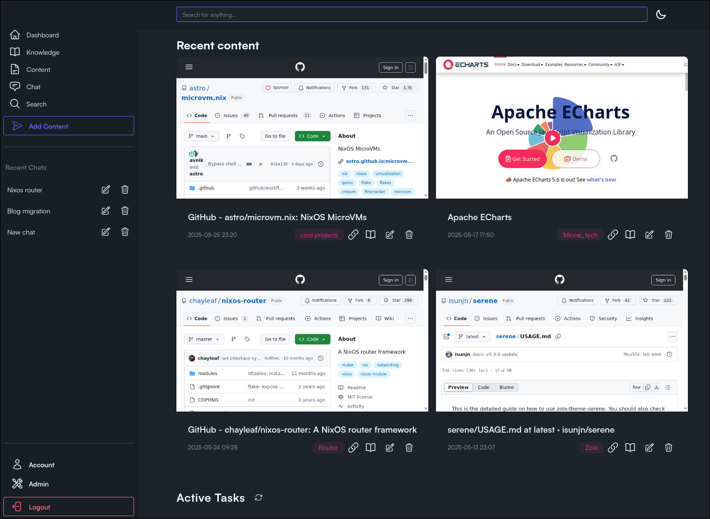

# Minne - A Graph-Powered Personal Knowledge Base

**Minne (Swedish for "memory")** is a personal knowledge management system and save-for-later application for capturing, organizing, and accessing your information. Inspired by the Zettelkasten method, it uses a graph database to automatically create connections between your notes without manual linking overhead.

[](https://github.com/perstarkse/minne/actions/workflows/release.yml)
[](https://www.gnu.org/licenses/agpl-3.0)
[](https://github.com/perstarkse/minne/releases/latest)



## Demo deployment

To test _Minne_ out, enter [this](https://minne-demo.stark.pub) read-only demo deployment to view and test functionality out.

## The "Why" Behind Minne

For a while I've been fascinated by Zettelkasten-style PKM systems. While tools like Logseq and Obsidian are excellent, I found the manual linking process to be a hindrance for me. I also wanted a centralized storage and easy access across devices.

While developing Minne, I discovered [KaraKeep](https://karakeep.com/) (formerly Hoarder), which is an excellent application in a similar space – you probably want to check it out! However, if you're interested in a PKM that builds an automatic network between related concepts using AI, offers search and the **possibility to chat with your knowledge resource**, and provides a blend of manual and AI-driven organization, then Minne might be worth testing.

## Core Philosophy & Features

Minne is designed to make it incredibly easy to save snippets of text, URLs, and other content (limited, pending demand). Simply send content along with a category tag. Minne then ingests this, leveraging AI to create relevant nodes and relationships within its graph database, alongside your manual categorization. This graph backend allows for discoverable connections between your pieces of knowledge.

You can converse with your knowledge base through an LLM-powered chat interface (via OpenAI compatible API, like Ollama or others). For those who like to see the bigger picture, Minne also includes an **experimental feature to visually explore your knowledge graph.**

You may switch and choose between models used, and have the possiblity to change the prompts to your liking. There is since release **0.1.3** the option to change embeddings length, making it easy to test another embedding model.

The application is built for speed and efficiency using Rust with a Server-Side Rendered (SSR) frontend (HTMX and minimal JavaScript). It's fully responsive, offering a complete mobile interface for reading, editing, and managing your content, including the graph database itself. **PWA (Progressive Web App) support** means you can "install" Minne to your device for a native-like experience. For quick capture on the go on iOS, a [**Shortcut**](https://www.icloud.com/shortcuts/9aa960600ec14329837ba4169f57a166) makes sending content to your Minne instance a breeze.

Minne is open source (AGPL), self-hostable, and can be deployed flexibly: via Nix, Docker Compose, pre-built binaries, or by building from source. It can run as a single `main` binary or as separate `server` and `worker` processes for optimized resource allocation.

## Tech Stack

- **Backend:** Rust. Server-Side Rendering (SSR). Axum. Minijinja for templating.
- **Frontend:** HTML. HTMX and plain JavaScript for interactivity.
- **Database:** SurrealDB
- **AI Integration:** OpenAI API compatible endpoint (for chat and content processing), with support for structured outputs.
- **Web Content Processing:** Relies on a Chromium instance for robust webpage fetching/rendering.

## Prerequisites

- **For Docker/Nix:** Docker or Nix installed. These methods handle SurrealDB and Chromium dependencies.
- **For Binaries/Source:**
  - A running SurrealDB instance.
  - Chromium (or a compatible Chrome browser) installed and accessible in your `PATH`.
  - Git (if cloning and building from source).
  - Rust toolchain (if building from source).

## Getting Started

You have several options to get Minne up and running:

### 1. Nix (Recommended for ease of dependency management)

If you have Nix installed, you can run Minne directly:

```bash
nix run 'github:perstarkse/minne#main'
```

This command will fetch Minne and its dependencies (including Chromium) and run the `main` (combined server/worker) application.

### 2. Docker Compose (Recommended for containerized environments)

This is a great way to manage Minne and its SurrealDB dependency together.

1. Clone the repository (or just save the `docker-compose.yml` below).

1. Create a `docker-compose.yml` file:

   ```yaml
   version: "3.8"
   services:
     minne:
       image: ghcr.io/perstarkse/minne:latest # Pulls the latest pre-built image
       # Or, to build from local source:
       # build: .
       container_name: minne_app
       ports:
         - "3000:3000" # Exposes Minne on port 3000
       environment:
         # These are examples, ensure they match your SurrealDB setup below
         # and your actual OpenAI key.
         SURREALDB_ADDRESS: "ws://surrealdb:8000"
         SURREALDB_USERNAME: "root_user" # Default from SurrealDB service below
         SURREALDB_PASSWORD: "root_password" # Default from SurrealDB service below
         SURREALDB_DATABASE: "minne_db"
         SURREALDB_NAMESPACE: "minne_ns"
         OPENAI_API_KEY: "your_openai_api_key_here" # IMPORTANT: Replace with your actual key
         #OPENAI_BASE_URL: "your_ollama_address" # Uncomment this and change it to override the default openai base url
         HTTP_PORT: 3000
         DATA_DIR: "/data" # Data directory inside the container
         RUST_LOG: "minne=info,tower_http=info" # Example logging level
       volumes:
         - ./minne_data:/data # Persists Minne's data (e.g., scraped content) on the host
       depends_on:
         - surrealdb
       networks:
         - minne-net
       # Waits for SurrealDB to be ready before starting Minne
       command: >
         sh -c "
           echo 'Waiting for SurrealDB to start...' &&
           # Adjust sleep time if SurrealDB takes longer to initialize in your environment
           until nc -z surrealdb 8000; do echo 'Waiting for SurrealDB...'; sleep 2; done &&
           echo 'SurrealDB is up, starting Minne application...' &&
           /usr/local/bin/main
         "
       # For separate server/worker:
       # command: /usr/local/bin/server # or /usr/local/bin/worker

     surrealdb:
       image: surrealdb/surrealdb:latest
       container_name: minne_surrealdb
       ports:
         # Exposes SurrealDB on port 8000 (primarily for direct access/debugging if needed,
         # not strictly required for Minne if only accessed internally by the minne service)
         - "127.0.0.1:8000:8000" # Bind to localhost only for SurrealDB by default
       volumes:
         # Persists SurrealDB data on the host in a 'surreal_database' folder
         - ./surreal_database:/database
       command: >
         start
         --log info # Consider 'debug' for troubleshooting
         --user root_user
         --pass root_password
         file:/database/minne_v1.db # Using file-based storage for simplicity
       networks:
         - minne-net

   volumes:
     minne_data: {} # Defines a named volume for Minne data (can be managed by Docker)
     surreal_database: {} # Defines a named volume for SurrealDB data

   networks:
     minne-net:
       driver: bridge
   ```

1. Run:

   ```bash
   docker compose up -d
   ```

   Minne will be accessible at `http://localhost:3000`.

### 3. Pre-built Binaries (GitHub Releases)

Binaries for Windows, macOS, and Linux (combined `main` version) are available on the [GitHub Releases page](https://github.com/perstarkse/minne/releases/latest).

1. Download the appropriate binary for your system.
1. **You will need to provide and run SurrealDB and have Chromium installed and accessible in your PATH separately.**
1. Set the required [Configuration](#configuration) environment variables or use a `config.yaml`.
1. Run the executable.

### 4. Build from Source

1. Clone the repository:
   ```bash
   git clone https://github.com/perstarkse/minne.git
   cd minne
   ```
1. **You will need to provide and run SurrealDB and have Chromium installed and accessible in your PATH separately.**
1. Set the required [Configuration](#configuration) environment variables or use a `config.yaml`.
1. Build and run:
   - For the combined `main` binary:
     ```bash
     cargo run --release --bin main
     ```
   - For the `server` binary:
     ```bash
     cargo run --release --bin server
     ```
   - For the `worker` binary (if you want to run it separately):
     ```bash
     cargo run --release --bin worker
     ```
     The compiled binaries will be in `target/release/`.

## Configuration

Minne can be configured using environment variables or a `config.yaml` file placed in the working directory where you run the application. Environment variables take precedence over `config.yaml`.

**Required Configuration:**

- `SURREALDB_ADDRESS`: WebSocket address of your SurrealDB instance (e.g., `ws://127.0.0.1:8000` or `ws://surrealdb:8000` for Docker).
- `SURREALDB_USERNAME`: Username for SurrealDB (e.g., `root_user`).
- `SURREALDB_PASSWORD`: Password for SurrealDB (e.g., `root_password`).
- `SURREALDB_DATABASE`: Database name in SurrealDB (e.g., `minne_db`).
- `SURREALDB_NAMESPACE`: Namespace in SurrealDB (e.g., `minne_ns`).
- `OPENAI_API_KEY`: Your API key for OpenAI (e.g., `sk-YourActualOpenAIKeyGoesHere`).
- `HTTP_PORT`: Port for the Minne server to listen on (Default: `3000`).

**Optional Configuration:**

- `RUST_LOG`: Controls logging level (e.g., `minne=info,tower_http=debug`).
- `DATA_DIR`: Directory to store local data like fetched webpage content (e.g., `./data`).
- `OPENAI_BASE_URL`: Base URL to a OpenAI API provider, such as Ollama.

**Example `config.yaml`:**

```yaml
surrealdb_address: "ws://127.0.0.1:8000"
surrealdb_username: "root_user"
surrealdb_password: "root_password"
surrealdb_database: "minne_db"
surrealdb_namespace: "minne_ns"
openai_api_key: "sk-YourActualOpenAIKeyGoesHere"
data_dir: "./minne_app_data"
# rust_log: "info"
# http_port: 3000
```

## Application Architecture (Binaries)

Minne offers flexibility in deployment:

- **`main`**: A combined binary running both server (API, web UI) and worker (background tasks) in one process. Ideal for simpler setups.
- **`server`**: Runs only the server component.
- **`worker`**: Runs only the worker component, suitable for deployment on a machine with more resources for intensive tasks.

This modularity allows scaling and resource optimization. The `main` binary or the Docker Compose setup (using `main`) is sufficient for most users.

## Usage

Once Minne is running:

1. Access the web interface at `http://localhost:3000` (or your configured port).
1. On iOS, consider setting up the [Minne iOS Shortcut](https://www.icloud.com/shortcuts/9aa960600ec14329837ba4169f57a166) for effortless content sending. **Add the shortcut, replace the [insert_url] and the [insert_api_key] snippets**.
1. Add notes, URLs, **audio files**, and explore your growing knowledge graph.
1. Engage with the chat interface to query your saved content.
1. Try the experimental visual graph explorer to see connections.

## AI Configuration & Model Selection

Minne relies on an OpenAI-compatible API for processing content, generating graph relationships, and powering the chat feature.

**Environment Variables / `config.yaml` keys:**

- `OPENAI_API_KEY` (required): Your API key for the chosen AI provider.
- `OPENAI_BASE_URL` (optional): Use this to override the default OpenAI API URL (`https://api.openai.com/v1`). This is essential for using local models via services like Ollama, or other API providers.
  - **Example for Ollama:** `http://<your-ollama-ip>:11434/v1`

### Changing Models

Once you have configured the `OPENAI_BASE_URL` to point to your desired provider, you can select the specific models Minne should use.

1. Navigate to the `/admin` page in your Minne instance.
1. The page will list the models available from your configured endpoint. You can select different models for processing content and for chat.
1. **Important:** For content processing, Minne relies on structured outputs (function calling). The model and provider you select for this task **must** support this feature.
1. **Embedding Dimensions:** If you change the embedding model, you **must** update the "Embedding Dimensions" setting in the admin panel to match the output dimensions of your new model (e.g., `text-embedding-3-small` uses 1536, `nomic-embed-text` uses 768). Mismatched dimensions will cause errors. Some newer models will accept a dimension argument, and for these setting the dimensions to whatever should work.

## Roadmap

I've developed Minne primarily for my own use, but having been in the selfhosted space for a long time, and using the efforts by others, I thought I'd share with the community. Feature requests are welcome.
The roadmap as of now is:

- Handle uploaded images wisely.
- An updated explorer of the graph database.
- A TUI frontend which opens your system default editor for improved writing and document management.

## Contributing

Contributions are welcome! Whether it's bug reports, feature suggestions, documentation improvements, or code contributions, please feel free to open an issue or submit a pull request.

## Development

Run test with
```rust
cargo test
```
There is currently a variety of unit tests for commonly used functions. Additional tests, especially integration tests would be very welcome.

## License

Minne is licensed under the **GNU Affero General Public License v3.0 (AGPL-3.0)**. See the [LICENSE](LICENSE) file for details. This means if you run a modified version of Minne as a network service, you must also offer the source code of that modified version to its users.
